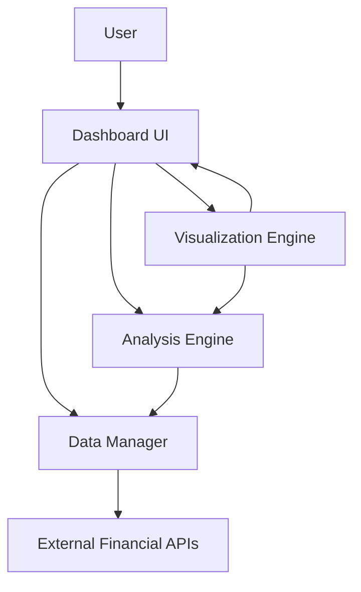
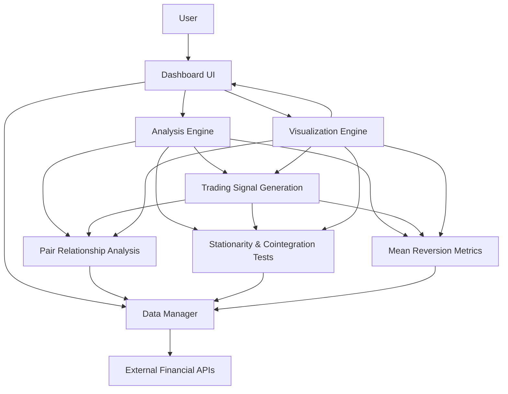

# Initial Ideas and Workflow for Pairs Trading Dashboard

This document preserves the initial architectural ideas and workflow created during the planning phase of the Pairs Trading Dashboard project.

## High-Level Architecture Overview



## Initial Folder Structure

```
dashboard_v1/
├── app.py                      # Main application entry point
├── config.py                   # Configuration settings
├── requirements.txt            # Project dependencies
├── README.md                   # Project overview
├── data/                       # Data management
│   ├── __init__.py
│   ├── fetcher.py              # API data fetching
│   ├── processor.py            # Data preprocessing
│   ├── storage.py              # Data caching/storage
│   └── README.md               # Data module documentation
├── analysis/                   # Statistical analysis
│   ├── __init__.py
│   ├── pairs.py                # Pairs relationship analysis
│   ├── statistics.py           # Statistical tests
│   ├── signals.py              # Trading signals generation
│   ├── metrics.py              # Performance metrics
│   └── README.md               # Analysis module documentation
├── visualization/              # Data visualization
│   ├── __init__.py
│   ├── charts.py               # Chart components
│   ├── layouts.py              # Dashboard layouts
│   ├── themes.py               # Visual styling
│   └── README.md               # Visualization module documentation
├── dashboard/                  # Dashboard components
│   ├── __init__.py
│   ├── components/             # Reusable UI components
│   │   ├── __init__.py
│   │   ├── input_panel.py      # User input components
│   │   ├── chart_panel.py      # Chart display components
│   │   └── summary_panel.py    # Summary statistics components
│   ├── callbacks.py            # Dash callbacks
│   ├── layouts.py              # Page layouts
│   └── README.md               # Dashboard module documentation
├── utils/                      # Utility functions
│   ├── __init__.py
│   ├── helpers.py              # Helper functions
│   ├── validators.py           # Input validation
│   └── README.md               # Utilities documentation
├── tests/                      # Unit and integration tests
│   ├── __init__.py
│   ├── test_data.py
│   ├── test_analysis.py
│   └── test_visualization.py
└── docs/                       # Additional documentation
    ├── architecture.md         # Detailed architecture explanation
    ├── user_guide.md           # User documentation
    ├── developer_guide.md      # Developer documentation
    └── alternative_implementations.md  # Alternative tech stacks
```

## Enhanced Architecture with Focus on Statistical Analysis

Based on feedback, the architecture was enhanced to place more emphasis on the statistical analysis components, which are the core of pairs trading.



## Enhanced Analysis Module Structure

```
analysis/
├── __init__.py
├── README.md                   # Comprehensive analysis module documentation
├── pair_relationship/          # Pair relationship analysis
│   ├── __init__.py
│   ├── price_ratio.py          # Price ratio calculations
│   ├── regression.py           # OLS regression and hedge ratio
│   ├── correlation.py          # Rolling correlation analysis
│   └── spread.py               # Spread calculations
├── stationarity/               # Stationarity and cointegration tests
│   ├── __init__.py
│   ├── adf_test.py             # Augmented Dickey-Fuller test
│   ├── cointegration.py        # Cointegration tests (Johansen)
│   └── hurst.py                # Hurst exponent calculation
├── mean_reversion/             # Mean reversion metrics
│   ├── __init__.py
│   ├── half_life.py            # Half-life of mean reversion
│   ├── z_score.py              # Z-score calculations
│   └── volatility.py           # Volatility analysis
├── signals/                    # Trading signal generation
│   ├── __init__.py
│   ├── entry_exit.py           # Entry and exit signal generation
│   ├── backtest.py             # Backtesting functionality
│   └── performance.py          # Performance metrics
└── utils/                      # Analysis-specific utilities
    ├── __init__.py
    ├── statistics.py           # Statistical helper functions
    └── transformations.py      # Data transformations
```

## Key Design Decisions

1. **Python-only Stack**: Using Dash/Plotly for the dashboard and pandas/numpy for analysis
2. **Modular Design**: Separating concerns into distinct modules (data, analysis, visualization, dashboard)
3. **Enhanced Analysis Focus**: Detailed breakdown of statistical analysis components
4. **Scalable Architecture**: Designed to accommodate future extensions beyond v1

## Technology Choices

- **Frontend**: Dash by Plotly (Python-based web application framework)
- **Data Analysis**: pandas, numpy, statsmodels
- **Data Visualization**: Plotly
- **Data Fetching**: yfinance or similar financial data API
- **Testing**: pytest

This document serves as a reference for the initial architectural decisions and can be used to guide the implementation of the Pairs Trading Dashboard.