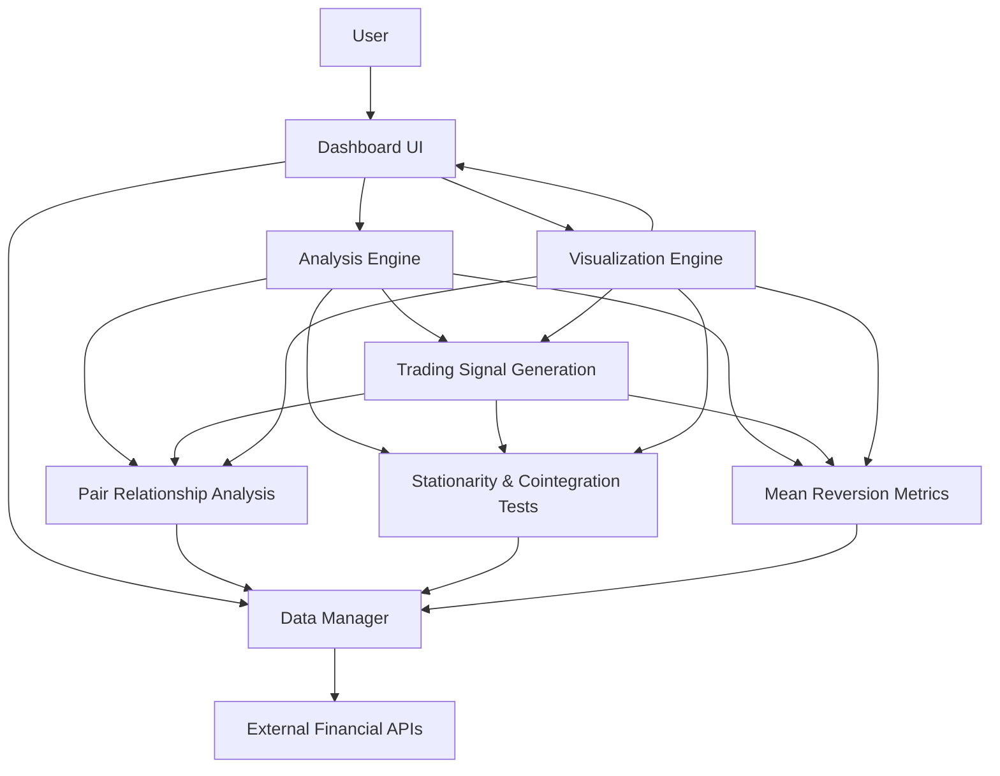
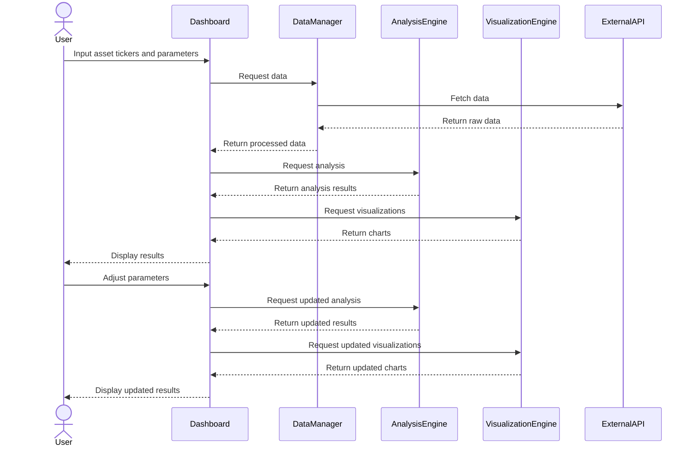
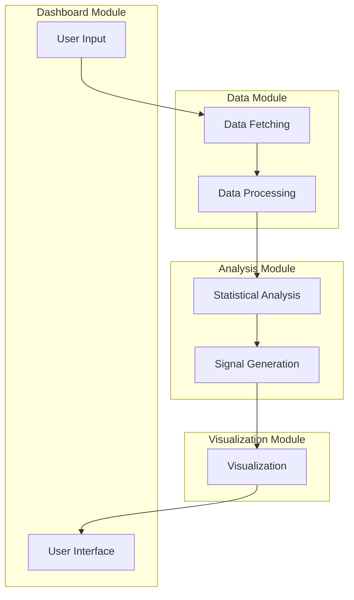
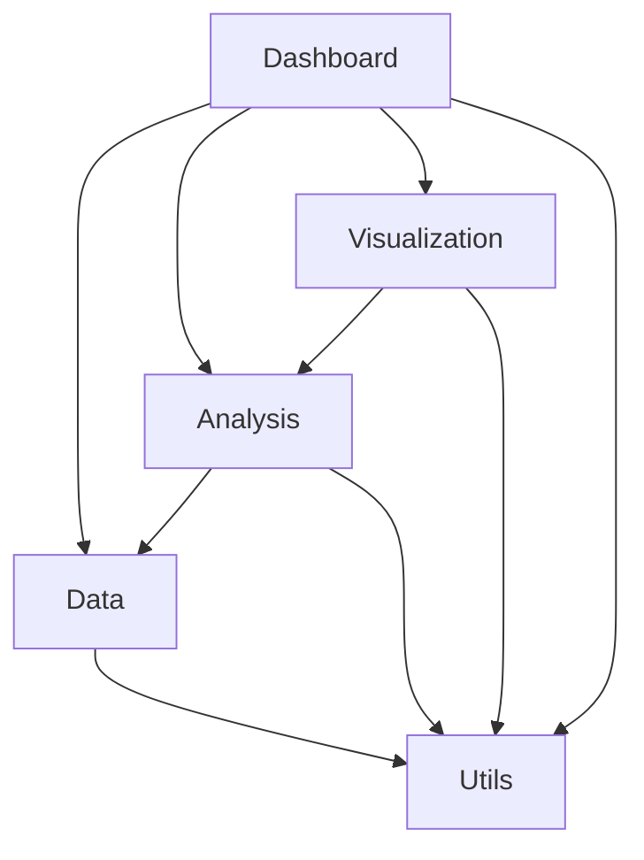

# Pairs Trading Dashboard Architecture

This document provides a comprehensive overview of the Pairs Trading Dashboard architecture, explaining how the different modules interact and the overall system design.

## System Overview

The Pairs Trading Dashboard is a Python-based web application that enables traders to analyze mean-reverting relationships between asset pairs for pairs trading strategies. The application follows a modular architecture with clear separation of concerns.



## Core Architectural Principles

The architecture is guided by the following principles:

1. **Modularity**: The system is divided into distinct modules with clear responsibilities
2. **Separation of Concerns**: Each module focuses on a specific aspect of the application
3. **Data Flow**: Clear and consistent data flow between components
4. **Extensibility**: Easy to extend with new features and analyses
5. **Maintainability**: Code organization that promotes maintainability
6. **Performance**: Efficient handling of data and calculations

## Module Interactions

### 1. User Interaction Flow



### 2. Data Flow



### 3. Component Dependencies



## Detailed Module Descriptions

### 1. Data Module

**Responsibility**: Fetching, processing, and managing financial data.

**Key Components**:
- **Fetcher**: Retrieves data from external APIs
- **Processor**: Cleans and prepares data for analysis
- **Storage**: Caches data for improved performance

**Interfaces**:
- `fetch_asset_data(ticker, start_date, end_date) -> DataFrame`
- `process_data(raw_data) -> DataFrame`
- `cache_data(key, data) -> None`
- `get_cached_data(key) -> DataFrame or None`

### 2. Analysis Module

**Responsibility**: Performing statistical analyses and generating trading signals.

**Key Components**:
- **Pair Relationship Analysis**: Analyzes relationships between assets
- **Stationarity Tests**: Tests for mean-reverting properties
- **Mean Reversion Metrics**: Quantifies mean reversion characteristics
- **Signal Generation**: Generates trading signals

**Interfaces**:
- `analyze_pair(asset1_data, asset2_data, params) -> AnalysisResults`
- `calculate_hedge_ratio(asset1_data, asset2_data) -> float`
- `test_stationarity(spread_data) -> TestResults`
- `generate_signals(spread_data, thresholds) -> SignalData`

### 3. Visualization Module

**Responsibility**: Creating interactive charts and visualizations.

**Key Components**:
- **Chart Components**: Reusable chart templates
- **Layout Management**: Arranges charts in the dashboard
- **Visual Styling**: Provides consistent styling

**Interfaces**:
- `create_chart(chart_type, data, options) -> Figure`
- `apply_theme(figure, theme) -> Figure`
- `create_layout(charts, layout_type) -> Layout`

### 4. Dashboard Module

**Responsibility**: Creating the user interface and handling interactions.

**Key Components**:
- **UI Components**: Reusable UI elements
- **Callbacks**: Handles user interactions
- **Layouts**: Defines dashboard structure

**Interfaces**:
- `create_dashboard(config) -> Dash App`
- `register_callbacks(app) -> None`
- `create_layout() -> Layout`

### 5. Utils Module

**Responsibility**: Providing utility functions used across the application.

**Key Components**:
- **Helpers**: General utility functions
- **Validators**: Input validation
- **Error Handlers**: Consistent error handling

**Interfaces**:
- `validate_input(input_value, rules) -> bool`
- `format_output(value, format_type) -> str`
- `handle_error(error, context) -> UserFriendlyError`

## Technical Architecture

### 1. Technology Stack

- **Language**: Python 3.8+
- **Web Framework**: Dash by Plotly
- **Data Analysis**: pandas, numpy, statsmodels
- **Visualization**: Plotly
- **Data Fetching**: yfinance
- **Testing**: pytest

### 2. Application Structure

```
dashboard_v1/
├── app.py                      # Main application entry point
├── config.py                   # Configuration settings
├── requirements.txt            # Project dependencies
├── data/                       # Data management
├── analysis/                   # Statistical analysis
├── visualization/              # Data visualization
├── dashboard/                  # Dashboard components
├── utils/                      # Utility functions
├── tests/                      # Unit and integration tests
└── docs/                       # Additional documentation
```

### 3. Execution Flow

1. `app.py` initializes the Dash application
2. Dashboard layout is created with input controls and placeholders for charts
3. Callbacks are registered to handle user interactions
4. When user inputs are changed, data is fetched and processed
5. Analysis is performed on the processed data
6. Visualizations are created based on analysis results
7. Dashboard is updated with new visualizations

## Design Patterns

The architecture incorporates several design patterns:

1. **Model-View-Controller (MVC)**:
   - Model: Data and Analysis modules
   - View: Visualization and Dashboard modules
   - Controller: Dashboard callbacks

2. **Factory Pattern**:
   - Chart factories for creating different visualization types
   - Component factories for creating UI elements

3. **Strategy Pattern**:
   - Pluggable analysis strategies
   - Configurable visualization strategies

4. **Observer Pattern**:
   - Reactive updates based on user input changes
   - Dashboard components observe data and analysis state

5. **Facade Pattern**:
   - High-level interfaces that hide implementation details
   - Simplified API for complex operations

## Error Handling Strategy

1. **Input Validation**:
   - Validate all user inputs before processing
   - Provide immediate feedback for invalid inputs

2. **Graceful Degradation**:
   - Handle API failures gracefully
   - Provide partial results when possible

3. **User Feedback**:
   - Convert technical errors to user-friendly messages
   - Provide guidance on how to resolve issues

4. **Logging**:
   - Comprehensive logging of errors
   - Include context information for debugging

## Performance Considerations

1. **Data Caching**:
   - Cache API responses to reduce external calls
   - Cache intermediate calculation results

2. **Lazy Loading**:
   - Load data and perform calculations only when needed
   - Implement pagination for large datasets

3. **Efficient Algorithms**:
   - Optimize statistical calculations for performance
   - Use vectorized operations where possible

4. **Resource Management**:
   - Properly manage memory for large datasets
   - Release resources when no longer needed

## Scalability Considerations

While v1 is designed for local hosting and individual use, the architecture considers future scalability:

1. **Modular Design**:
   - Components can be scaled independently
   - Clear interfaces allow for distributed deployment

2. **Stateless Processing**:
   - Analysis functions are stateless
   - Enables horizontal scaling

3. **Caching Strategy**:
   - Designed to support distributed caching
   - Reduces redundant calculations

4. **API-First Approach**:
   - Internal components communicate through well-defined interfaces
   - Enables future microservices architecture

## Security Considerations

1. **Input Sanitization**:
   - Validate and sanitize all user inputs
   - Prevent injection attacks

2. **API Key Management**:
   - Secure storage of API credentials
   - Rate limiting for external API calls

3. **Data Privacy**:
   - Local processing of sensitive data
   - No unnecessary data storage

## Testing Strategy

1. **Unit Testing**:
   - Test individual functions and components
   - Focus on core algorithms and calculations

2. **Integration Testing**:
   - Test interactions between modules
   - Verify data flow and transformations

3. **End-to-End Testing**:
   - Test complete user workflows
   - Verify dashboard functionality

4. **Performance Testing**:
   - Benchmark critical operations
   - Identify performance bottlenecks

## Deployment Considerations

For v1 (local hosting):

1. **Environment Setup**:
   - Python virtual environment
   - Dependencies management with requirements.txt

2. **Configuration**:
   - External configuration for API keys
   - Environment-specific settings

3. **Local Server**:
   - Dash development server
   - Optional: Gunicorn for improved performance

## Future Architecture Evolution

The architecture is designed to evolve in future versions:

1. **Multi-Asset Support**:
   - Extend analysis to support multiple pairs
   - Implement portfolio-level analysis

2. **Advanced Analytics**:
   - Machine learning models for pair selection
   - Advanced risk management metrics

3. **Distributed Architecture**:
   - Microservices for scalability
   - Message queues for asynchronous processing

4. **User Management**:
   - Authentication and authorization
   - User preferences and saved analyses

## Conclusion

The Pairs Trading Dashboard architecture provides a solid foundation for building a comprehensive tool for pairs trading analysis. The modular design, clear separation of concerns, and well-defined interfaces ensure maintainability and extensibility, while the focus on performance and user experience ensures a practical and useful application.