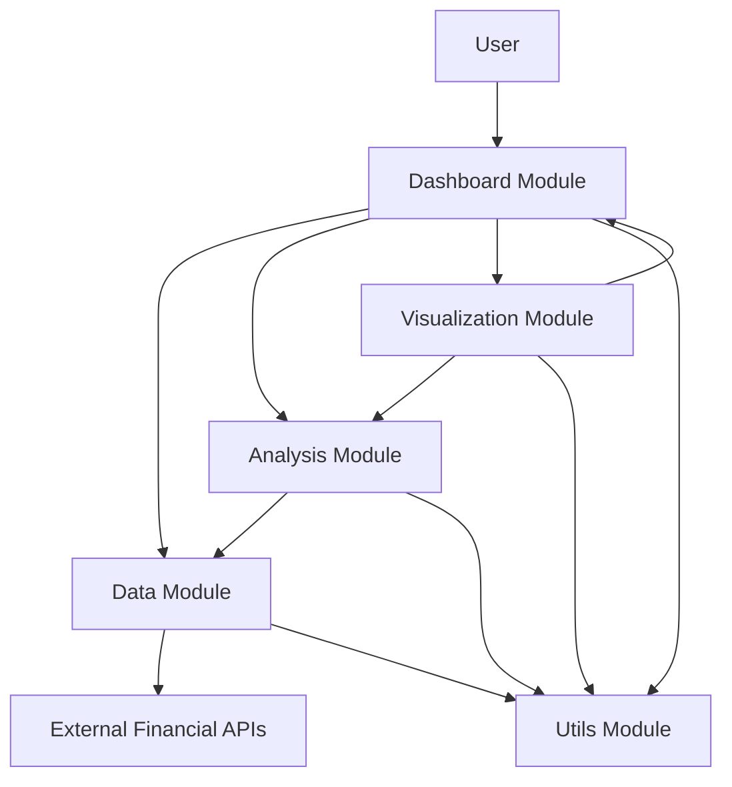
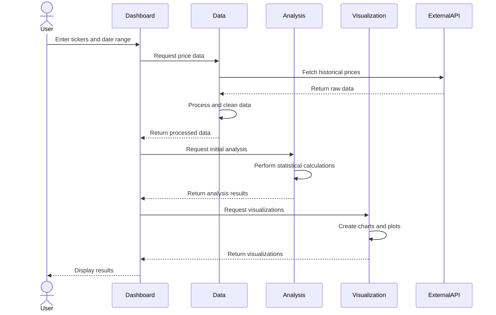
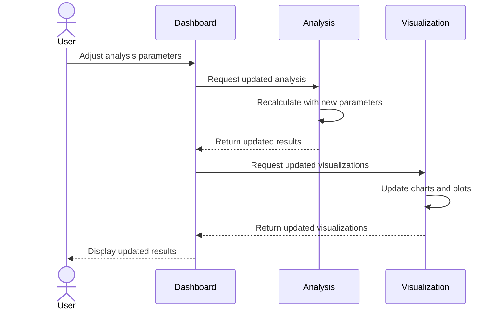
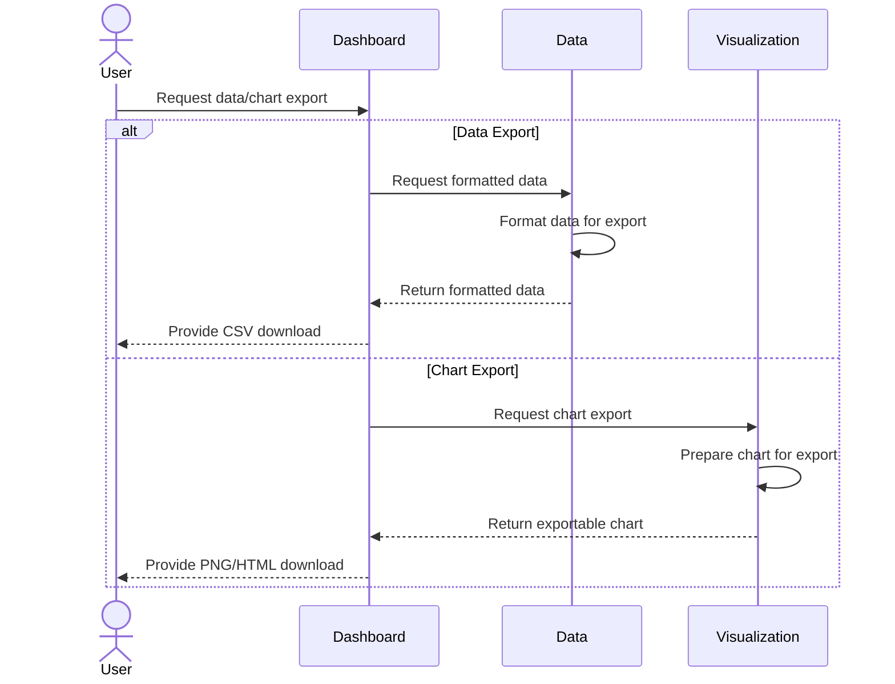

# Pairs Trading Dashboard: System Overview

This document provides a high-level overview of how the different components of the Pairs Trading Dashboard connect and interact with each other.

## System Architecture

The Pairs Trading Dashboard follows a modular architecture with clear separation of concerns. The system is divided into five main modules:

## Module Interactions

### 1. User to Dashboard Interaction

The user interacts with the Dashboard Module through the web interface:
- Inputs asset tickers (e.g., GLD, SLV)
- Selects date range for analysis
- Adjusts parameters (rolling window, z-score thresholds)
- Views analysis results and visualizations
- Exports data and charts

### 2. Dashboard to Data Module Interaction

The Dashboard Module requests data from the Data Module:
- Passes user-selected tickers and date range
- Receives processed price data for analysis
- Handles data refresh when user inputs change

### 3. Dashboard to Analysis Module Interaction

The Dashboard Module requests analysis from the Analysis Module:
- Passes processed data and user parameters
- Receives analysis results (hedge ratio, z-scores, signals, etc.)
- Triggers re-analysis when parameters change

### 4. Dashboard to Visualization Module Interaction

The Dashboard Module requests visualizations from the Visualization Module:
- Passes analysis results to be visualized
- Receives interactive charts and plots
- Updates visualizations when analysis results change

### 5. Analysis Module to Data Module Interaction

The Analysis Module uses data from the Data Module:
- Receives clean, processed price data
- May request additional data as needed
- Returns analysis results that can be cached

### 6. Visualization Module to Analysis Module Interaction

The Visualization Module transforms analysis results into visual representations:
- Receives statistical results from Analysis Module
- Creates appropriate chart types for each analysis
- Adds interactive features to visualizations

### 7. All Modules to Utils Module Interaction

All modules use common utilities from the Utils Module:
- Input validation
- Error handling
- Formatting and conversion
- Performance optimization

## Data Flow

The overall data flow through the system follows this sequence:

1. **User Input**: User provides asset tickers, date range, and parameters
2. **Data Fetching**: System retrieves historical price data from financial APIs
3. **Data Processing**: Raw data is cleaned, aligned, and prepared for analysis
4. **Statistical Analysis**: System performs various statistical analyses on the data
5. **Signal Generation**: Trading signals are generated based on statistical results
6. **Visualization**: Analysis results are transformed into interactive charts
7. **Presentation**: Visualizations and results are presented to the user
8. **Interaction**: User can adjust parameters and see updated results in real-time
9. **Export**: User can export data, charts, and analysis results

## Key Workflows

### 1. Initial Analysis Workflow

### 2. Parameter Adjustment Workflow

### 3. Export Workflow

## Technical Integration

### 1. Module Communication

Modules communicate through well-defined function calls and data structures:
- Clear interfaces between modules
- Consistent data formats
- Proper error handling and validation

### 2. State Management

The application state is managed primarily in the Dashboard Module:
- User inputs and preferences
- Current analysis results
- Visualization settings
- Export options

### 3. Performance Optimization

Several strategies are employed to ensure good performance:
- Data caching to reduce API calls
- Efficient statistical algorithms
- Lazy loading of visualizations
- Incremental updates when possible

## User Experience Flow

From the user's perspective, the system provides a seamless experience:

1. **Input**: User enters two asset tickers and selects a date range
2. **Initial Analysis**: System automatically performs basic analysis
3. **Exploration**: User can explore different charts and metrics
4. **Refinement**: User can adjust parameters to refine the analysis
5. **Interpretation**: System provides interpretations of statistical results
6. **Decision**: User can identify potential trading opportunities
7. **Export**: User can export data and charts for further analysis or record-keeping

## Integration Points for Future Extensions

The architecture is designed to accommodate future extensions:

1. **Additional Data Sources**:
   - The Data Module can be extended to support more data providers
   - New data types can be incorporated (fundamentals, sentiment, etc.)

2. **Advanced Analysis Methods**:
   - The Analysis Module can be extended with machine learning models
   - New statistical tests and metrics can be added

3. **Enhanced Visualization**:
   - The Visualization Module can incorporate more advanced chart types
   - 3D visualizations for multi-dimensional analysis

4. **Extended Dashboard Features**:
   - User authentication and saved analyses
   - Alerts and notifications for trading signals
   - Portfolio-level analysis

## Conclusion

The Pairs Trading Dashboard integrates multiple modules into a cohesive system that enables traders to analyze mean-reverting relationships between asset pairs. The modular architecture ensures that each component has clear responsibilities while working together to provide a seamless user experience.

By understanding how these components connect and interact, developers can efficiently implement, maintain, and extend the system to meet evolving requirements.